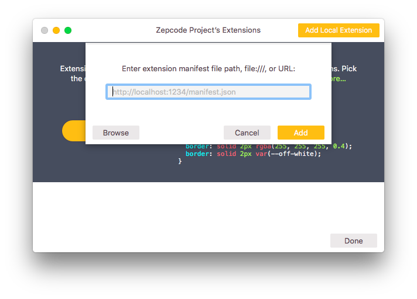

<p align="center">

</p>

<p align="center">
  <a href="https://extensions.zeplin.io">
    
  </a>
  <a href="https://travis-ci.org/artemnovichkov/zepcode">
    
  </a>
</p>

[Zeplin extension](https://extensions.zeplin.io/) that generates Swift snippets from colors, fonts and layers.

## Features

- 🖍 Color pallette for iOS

  <details><summary>Example</summary>

  ```swift
  import UIKit

  extension UIColor {

      static let electricBlue = UIColor(red: 0/255, green: 86/255, blue: 255/255, alpha: 1)
  }
  ```
  </details>
  <details><summary>Example with custom initializer</summary>

  ```swift
  import UIKit

  extension UIColor {

      convenience init(r red: Int, g green: Int, b blue: Int, a: CGFloat = 1) { // swiftlint:disable:this identifier_name
          self.init(red: CGFloat(red) / 255, 
                    green: CGFloat(green) / 255, 
                    blue: CGFloat(blue) / 255, 
                    alpha: a)
      }

      static let electricBlue = UIColor(r: 0, g: 86, b: 255)
  }
  ```
  </details>

- ✏️ Fonts for iOS

  <details><summary>Example</summary>

  ```swift
  import UIKit

  extension UIFont {

      static func BloggerSansBold(ofSize: CGFloat) -> UIFont {
          return UIFont(name: "BloggerSans-Bold", size: size)!
      }
  }
  ```

  </details>

- 🚧 Snippets for borders and corner radius

  <details><summary>Example</summary>

  ```swift
  view.layer.borderWidth = 4
  view.layer.borderColor = UIColor.white.cgColor
  view.layer.cornerRadius = 40
  ```

  </details>

- 🌚 Snippets for shadows

  <details><summary>Example</summary>

  ```swift
  view.layer.shadowColor = UIColor(r: 0, g: 0, b: 0, a: 0.5).cgColor
  view.layer.shadowOpacity = 1
  view.layer.shadowOffset = CGSize(width: 0, height: 2)
  view.layer.shadowRadius = 4 / 2
  let rect = view.bounds.insetBy(dx: -2, dy: -2)
  view.layer.shadowPath = UIBezierPath(rect: rect).cgPath
  ```

  </details>

- 🎨 Gradients (Work in progress)

  <details><summary>Linear gradient example</summary>

   Check out [LinearGradientPlayground](.github/LinearGradientPlayground.zip) and read explanation of the implementation [here](https://github.com/artemnovichkov/zepcode/issues/1#issuecomment-370118449).

  </details>
   <details><summary>Radial gradient example</summary>

  ```swift
  final class RadialGradientView: UIView {

      private var radius: CGFloat {
          return min(bounds.width / 2, bounds.height / 2)
      }

      private let colors = [UIColor.red.cgColor, UIColor.neonGreen.cgColor]

      override init(frame: CGRect) {
          super.init(frame: frame)
          clipsToBounds = true
      }

      required init?(coder aDecoder: NSCoder) {
          fatalError("init(coder:) has not been implemented")
      }

      override func layoutSubviews() {
          super.layoutSubviews()
          layer.cornerRadius = radius
      }

      override func draw(_ rect: CGRect) {
          let context = UIGraphicsGetCurrentContext()

          let colorSpace = CGColorSpaceCreateDeviceRGB()
          let colorsCount = colors.count
          var locations = (0...colorsCount - 1).map { i in
              return CGFloat(i) / CGFloat(colorsCount)
          }

          guard let gradient = CGGradient(colorsSpace: colorSpace, colors: colors as CFArray, locations: locations) else {
              return
          }

          context?.drawRadialGradient(gradient,
                                     startCenter: center,
                                     startRadius: 0,
                                     endCenter: center,
                                     endRadius: radius,
                                     options: CGGradientDrawingOptions(rawValue: 0))
          }
  }
  ```

  </details>

## Options

#### Use color names
Use color names from Color Palette or default `UIColor(red:green:blue:alpha:)` initializers.

#### Use custom color initializer
Use `UIColor(r:g:b:a:)` initializer.

#### Use layer extension for shadows
Use this function for shadow parameters. Don't forget to add this extension to your project.

```swift
import UIKit

extension CALayer {

    func makeShadow(color: UIColor,
                    x: CGFloat = 0,
                    y: CGFloat = 0,
                    blur: CGFloat = 0,
                    spread: CGFloat = 0) {
        shadowColor = color.cgColor
        shadowOpacity = 1
        shadowOffset = CGSize(width: x, height: y)
        shadowRadius = blur / 2
        if spread == 0 {
            shadowPath = nil
        }
        else {
            let rect = bounds.insetBy(dx: -spread, dy: -spread)
            shadowPath = UIBezierPath(rect: rect).cgPath
        }
    }
}
```

## How to Install

- Download and unzip [the latest release](https://github.com/artemnovichkov/zepcode/releases/download/0.5.4/zepcode.zip)
- During the beta, to debug and work with your extensions, you can add them to your Zeplin projects locally from their Extensions window. On the Mac app, holding down the Option key will enable the “Add Local Extension” option on the title bar:

- Enter the path to `manifest.json` and click Add.

That's pretty much it. Go ahead, click a layer!

## How to make a changes

First, you need last stable Node.js `^8.9.4`. Follow this [guide](https://github.com/creationix/nvm/blob/master/README.md#installation) if you don't have any.

Next, install project dependencies:

```bash
npm i
```

To start developing, to make a build or to execute some functions from extension follow this [guide](https://github.com/zeplin/zem#scripts).

To learn more about zem, [see documentation](https://github.com/zeplin/zem).

If you like to take full control of your build process you can try [zero](https://github.com/baybara-pavel/zero) boilerplate.

## Authors

Artem Novichkov, novichkoff93@gmail.com [](https://www.codementor.io/artemnovichkov?utm_source=github&utm_medium=button&utm_term=artemnovichkov&utm_campaign=github)

Baybara Pavel, baybara.pavel@gmail.com

## License

Zepcode is available under the MIT license. See the LICENSE file for more info.
